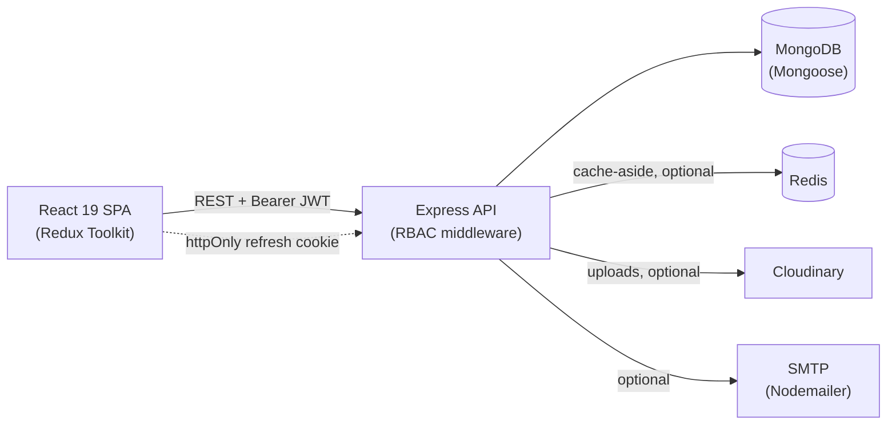
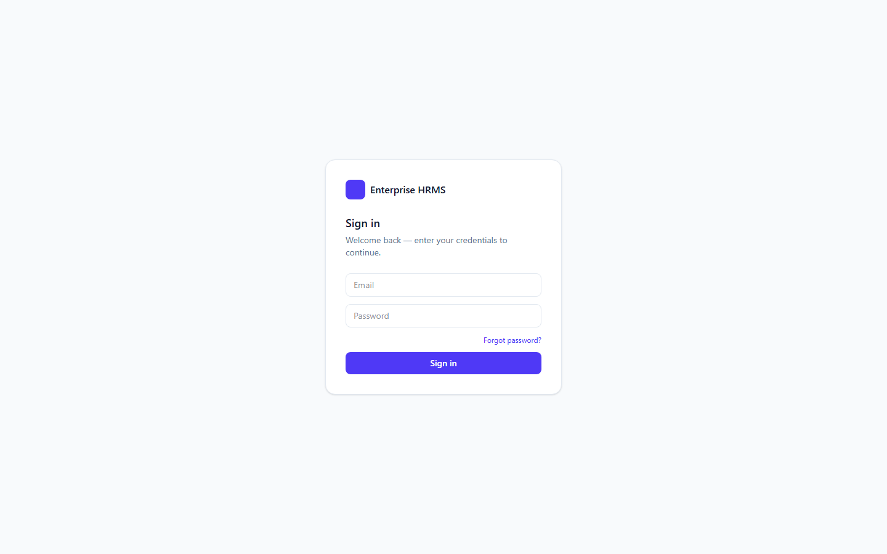
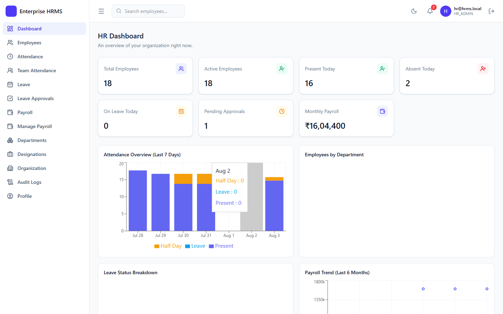
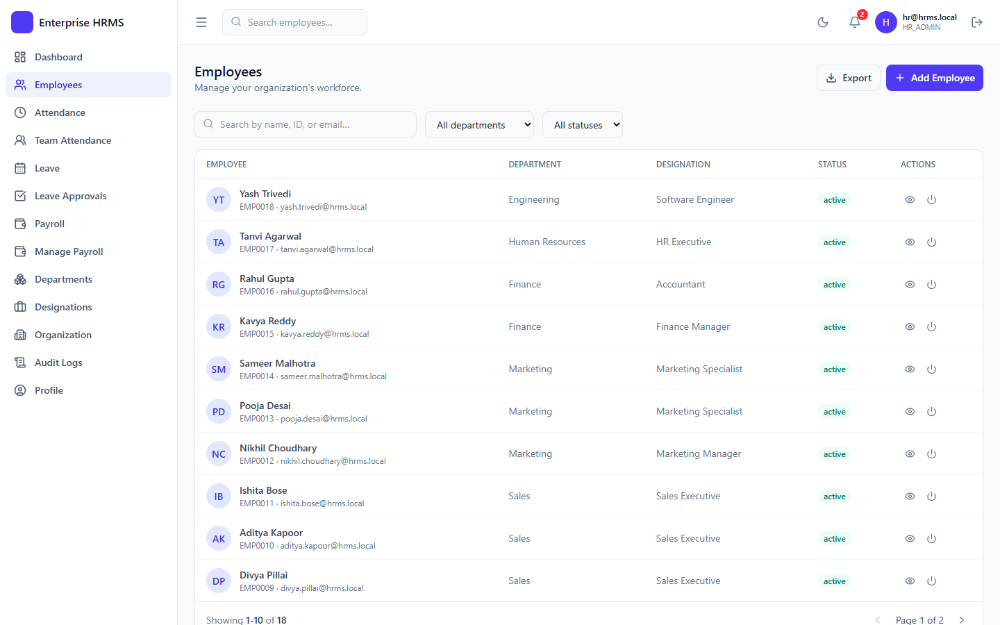
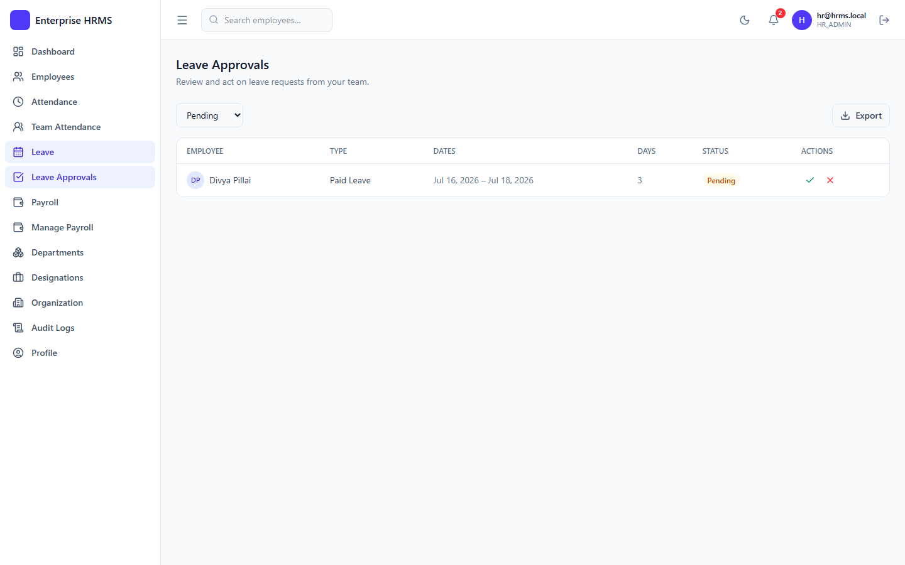
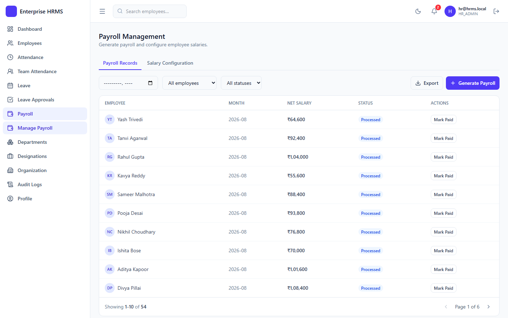

# Enterprise HRMS

A portfolio-grade Enterprise HR Management System (MERN) with server-enforced RBAC and a documented production-grade concurrency bug fix.


## Overview

A full employee-lifecycle HR platform — think a simplified Zoho People / Keka
— covering authentication & RBAC, org structure, employee records,
attendance, leave with approvals, payroll, role-specific dashboards,
notifications, audit logs, global search, and Excel export. Built as a
structured, interview-defensible full-stack project: every module is
intentionally kept simple and explainable rather than maximally "enterprise."

## Problem

Most portfolio HR systems stop at CRUD. This one adds two things a real
engineering interview would actually probe: RBAC enforced **server-side**
down to query-level scoping (a manager can't see another team's data by
editing the URL), and a documented, root-caused production-grade concurrency
bug — not a hypothetical one, a real bug this project shipped and then fixed
(see BUG-001 below).

## Architecture



**Scope decisions worth knowing:**
- **`User` vs. `Employee` are separate models.** `User` is the login identity
  (email/password/role); `Employee` is the HR profile (department, salary,
  etc). This lets `SUPER_ADMIN` exist without an HR record and mirrors how
  most real HRMS platforms split auth from HR data.
- **Attendance and Leave share data.** Approved leave writes `Attendance`
  records with `status: 'Leave'` — no separate "who's on leave today"
  bookkeeping needed.
- **Redis and Cloudinary are both optional in development.** The app runs
  correctly with either disabled — Redis falls back to a no-op cache client,
  uploads fail with a clear `503` rather than crashing.

### RBAC matrix

| Action | SUPER_ADMIN | HR_ADMIN | MANAGER | EMPLOYEE |
|---|:---:|:---:|:---:|:---:|
| Manage Organization | ✅ | ✅ | ❌ | ❌ |
| Departments/Designations CRUD | ✅ | ✅ | view | view |
| Employees CRUD | ✅ | ✅ | view team | view self |
| Attendance check-in/out | ✅ | ✅ | ✅ | ✅ |
| View all attendance | ✅ | ✅ | team only | self only |
| Apply leave | ✅ | ✅ | ✅ | ✅ |
| Approve/reject leave | ✅ | ✅ (fallback) | direct reports | ❌ |
| Configure salary / generate payroll | ✅ | ✅ | ❌ | ❌ |
| View own payroll | ✅ | ✅ | ✅ | ✅ |
| Audit logs / Excel export | ✅ | ✅ | ❌ | ❌ |

## Engineering Decisions

- **One generic `Approval` model, not a leave-specific one.** Only
  `LeaveRequest` uses it today (`requestType: 'LEAVE'`), but the shape
  (`requestType` + `requestId`) means a future request type could reuse it
  without a new workflow engine.
- **Manager scoping is enforced server-side**, not just hidden in the UI.
  Every team-scoped endpoint validates that an explicit `employee` filter is
  actually within the manager's team before applying it.
- **Refresh-token rotation is atomic and hashed.** Access tokens are
  short-lived (15m) and held only in memory (Redux); the refresh token
  (7d) is rotated on every use, stored **hashed** (SHA-256, never raw) so a
  single session can be revoked without invalidating every other session,
  and delivered as an httpOnly cookie the frontend JS never touches. This
  decision is what BUG-001 (below) exposed and then hardened.
- **Passwords are hashed with bcrypt** (10 salt rounds); never logged or
  returned by any API (`select: false` on the schema field). Every
  sensitive endpoint's role check is verified directly in
  `RBAC_TEST_REPORT.md`, independent of what the frontend happens to show.

### Case study: BUG-001 — the session that logged itself out

**Symptom:** Login works and the dashboard loads, but a browser refresh
sometimes logs the user back out even though the refresh-token cookie is
still valid.

**Root cause, three layers deep:**
1. `client/src/App.jsx` dispatched `bootstrapAuth()` on mount with no guard
   against duplicate invocation — React `<StrictMode>` double-invokes
   effects in development, firing **two concurrent**
   `POST /auth/refresh-token` requests on the same cookie.
2. The backend's rotation logic did a non-atomic read-then-write
   (`findOne()` → mutate → `.save()`), so both concurrent requests could
   read the token as "not yet revoked" before either write landed.
3. Refresh tokens had no per-token nonce; JWT `iat` only has
   second-granularity, so two tokens minted in the same second were
   byte-identical, throwing a duplicate-key error on the unique
   `tokenHash` index.

Whichever racing request lost got rejected, and because Redux applies
reducers in promise-settlement order (not dispatch order), the rejection
sometimes overwrote a perfectly valid `authenticated` state.

**Fix:** an RTK `condition` guard on `bootstrapAuth` (no second concurrent
network call), a random `jti` nonce on every minted refresh token, and an
atomic `findOneAndUpdate({ tokenHash, user, revokedAt: null, expiresAt: { $gt: now } }, { revokedAt: now })`
in place of `findOne` + `save()`.

**Verified:** reproduced directly via two concurrent curl requests on one
fresh cookie (one `409`, one `401`, pre-fix); re-ran after the fix (one
clean `200` with rotated cookie, one clean `401` — no crash, no lost
session). Full writeup in `BUGS.md`.

## Trade-offs

- **In-memory rate limiter, not Redis-backed.** `express-rate-limit`'s
  default store is keyed per-process — correct for a single instance, but
  behind a load balancer with multiple instances the 20-req/15-min login
  limit is trivially bypassed. Chose simplicity for a single-instance
  deployment over `rate-limit-redis` (which the stack could support today).
- **Notifications are polled (30s), not pushed via WebSockets.** Simpler to
  build and reason about; the trade-off is up to 30s of staleness, which is
  fine at this scale but wouldn't hold up as a real-time collaboration
  requirement.
- **No automated browser E2E suite (Playwright/Cypress).** Coverage is
  Jest/Supertest at the API layer plus a documented manual QA pass — real
  and repeatable, but doesn't catch purely client-side rendering bugs the
  way a browser-driven suite would (see BUG-004, caught by lint, not by any
  test).
- **Single-tenant by design** — one `Organization` document per deployment,
  not a multi-tenant SaaS. Simpler data model, at the cost of not being
  resellable as-is.
- **No frontend code-splitting yet.** Ships as one ~934KB JS bundle. Correct
  and fine at this scale; would need `React.lazy` + route-based splitting
  before it'd be acceptable on slow connections at real scale.

## Testing

```bash
cd server && npm run lint && npm test    # ESLint + Jest (unit + integration)
cd client && npm run lint && npm run build   # oxlint + production build
```

**74 backend tests, verified passing** (13 suites, ~19s):
- **47 unit tests** (no DB): JWT tokens, password hashing, pagination math,
  leave-day calculation, attendance-status derivation, payroll gross/net
  calculation.
- **27 integration tests** (Supertest + in-memory MongoDB): auth, RBAC
  boundaries, employee CRUD, the leave apply→approve flow, payroll
  generation.

This project has also been through a full manual QA pass (auth lifecycle,
RBAC, every CRUD module, uploads, pagination/search/filters, dashboards,
exports), producing **4 in-repo QA artifacts**: [`BUGS.md`](BUGS.md) (5 real
bugs found and fixed, root-caused),
[`TEST_REPORT.md`](TEST_REPORT.md), [`API_TEST_REPORT.md`](API_TEST_REPORT.md)
(61 endpoints inventoried), and [`RBAC_TEST_REPORT.md`](RBAC_TEST_REPORT.md).

## Screenshots

**Login**


**HR Dashboard**


**Employees**


**Leave Approvals**


**Payroll Management**


## Getting Started

**Prerequisites:** Node.js 20+ (built/tested on Node 22), MongoDB (local
`mongod` or a free [MongoDB Atlas](https://www.mongodb.com/atlas) cluster).
Optional: Redis, Cloudinary account, SMTP credentials.

### Backend

```bash
cd server
cp .env.example .env      # edit MONGO_URI and any other values you need
npm install
npm run seed                # populates realistic demo data (see below)
npm run dev                  # http://localhost:5000/api/health
```

### Frontend

```bash
cd client
cp .env.example .env
npm install
npm run dev                   # http://localhost:5173
```

### Environment variables

**`server/.env`** — see [`server/.env.example`](server/.env.example) for the
full list (`MONGO_URI`, `JWT_ACCESS_SECRET`/`JWT_REFRESH_SECRET`,
`REDIS_ENABLED`/`REDIS_URL`, `CLOUDINARY_*`, `EMAIL_ENABLED`/`SMTP_*`,
`CLIENT_URL`, `NODE_ENV`). **`client/.env`** — `VITE_API_BASE_URL` (baked in
at build time; see Docker note below).

### Demo data & accounts

```bash
cd server && npm run seed
```

⚠️ **Destructive** — clears every collection it seeds first. Only run
against a database you're fine wiping; never against real employee/user
data. Creates a full organization, 18 employees across 5 departments,
~2 weeks of attendance, a mix of leave requests, and 3 months of payroll.

All seeded accounts share the password **`Demo@1234`** (published here
intentionally — see below):

| Role | Email |
|---|---|
| SUPER_ADMIN | `admin@hrms.local` |
| HR_ADMIN | `hr@hrms.local` |
| MANAGER | `arjun.mehta@hrms.local` / `sara.khan@hrms.local` |
| EMPLOYEE | `rohan.verma@hrms.local` (+ more — see `server/src/seed/seed.js`) |

### Docker

```bash
docker compose up --build
```

Runs MongoDB, Redis, the API, and the nginx-served frontend together
(`docker-compose.yml`, root). Override secrets via a root `.env` file or
inline env vars. The client's `VITE_API_BASE_URL` is baked in at build
time — rebuild with `--build-arg VITE_API_BASE_URL=...` if the API isn't at
`localhost:5000`.

### Before deploying this anywhere real

The defaults here are tuned for **local development only**:
1. **Rotate both JWT secrets** — the placeholders in this public repo can
   forge a token for any user, including `SUPER_ADMIN`, if left in place.
2. **Serve over HTTPS** — in production the refresh-token cookie requires
   `secure: true`, so plain HTTP silently breaks session persistence.
3. **Set `CLIENT_URL` to the exact production origin** — CORS here allows
   exactly one configured origin, no wildcard.
4. **Never expose MongoDB/Redis directly** — the shipped compose file maps
   both ports straight to the host with no auth; fine on a laptop, not on a
   public VM.
5. **Never seed a real environment**, and rotate/delete the demo accounts
   above before onboarding real users.

## Project Structure

```
enterprise-hrms/
├── client/                    React + Vite frontend
│   └── src/{api,app,components,features,layouts,pages,routes}/
├── server/                    Express backend
│   └── src/{config,controllers,middleware,models,routes,services,seed,utils,validations}/
│   └── tests/{unit,integration}/
├── docker-compose.yml
├── BUGS.md, *_TEST_REPORT.md      internal QA records (see Testing above)
└── README.md
```

## Future Improvements / Roadmap

- Move the rate limiter's store to Redis (`rate-limit-redis`) before running
  more than one server instance.
- Route-level code-splitting (`React.lazy`) to bring the ~934KB bundle down.
- Centralized error tracking (Sentry or similar) — currently only
  `morgan('combined')` access logs to stdout.
- Automated MongoDB backups for any real deployment.
- Dependency advisories currently open, tracked rather than force-upgraded
  (breaking changes, not exploitable in this app's current usage):
  `bcrypt`'s `node-pre-gyp`→`tar` chain (critical, fix requires `bcrypt@6`),
  `exceljs`→`uuid` (moderate), and `react-router`
  ([GHSA-qwww-vcr4-c8h2](https://github.com/advisories/GHSA-qwww-vcr4-c8h2),
  high, scoped to RSC mode which this app doesn't use).

## License

Not yet licensed — no `LICENSE` file exists in this repository, so all
rights are reserved by default (both `package.json` files reflect this as
`"license": "UNLICENSED"`).

## Learn More

- [GitHub](https://github.com/jaimaheshwari1706)
